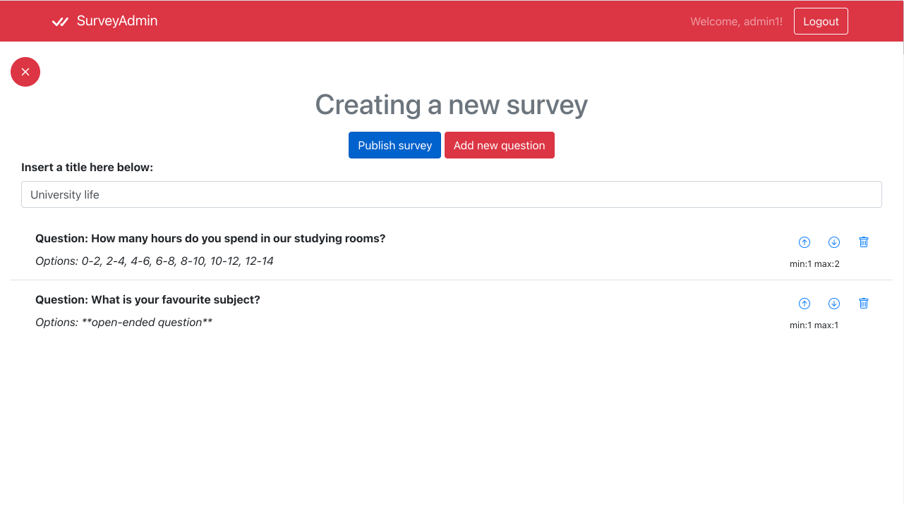

# Exam #1: "Survey"
## Student: s290198 GALOTA SIMONE 

## React Client Application Routes

- Route `/`: It is the home page. It shows the list of all surveys available and ready to be answered to.
- Route `/login`: It is used for logging in. It shows the form where inserting the admin credentials .
- Route `/surveys:id`: It is used for answering to a survey. It shows all the questions of the survey. The "id" is the id belonging to that survey.
- Route `/admin`: It is the personal page of the admin. It shows all the questions published by the admin who is logged in.
- Route `/admin/creation`: It is used by the admin who is logged in for creating a survey. It shows an ad hoc form to insert question and possible options (if MCQ).
- Route `/admin/:id`: It is used by the admin who is logged in. It shows all the answers received for a survey. The "id" is the id belonging to that survey.

## API Server

- GET `/api/surveys`
  - Description: Retrieve the list of all surveys
  - Request body: _None_
  - Response: `200 OK` (success) or `500 Internal Server Error` (generic error)
  - Response body: An array of Survey objects.
  
- GET `/api/surveys/:id`
  - Description: Retrieve the questions of a given survey
  - Request parameters: id of a survey
  - Request body: _None_
  - Response: `200 OK` (success) or `500 Internal Server Error` (generic error)
  - Response body: An object Survey containing the questions requested.

- POST `/api/surveys/:id`
  - Description: Create an answer for a given survey
  - Request parameters: id of a survey
  - Request body: surveyID, user, answers (JSON format)
  - Response: `201 Created` (success) or `422 Unprocessable Entity` (invalid request body) or `503 Service Unavailable` (generic error) 
  - Response body: An object describing a series of answers.

- GET `/api/admin`
  - Description: Retrieve the list of all surveys for a given admin
  - Request parameters: id of the user
  - Request body: _None_
  - Response: `200 OK` (success) or `500 Internal Server Error` (generic error)
  - Response body: An array of survey objects.

- GET `/api/admin/:id`
  - Description: Retrieve the list of all answers for a given survey published by a given admin
  - Request parameters: id of a survey
  - Request body: _None_
  - Response: `200 OK` (success) or `500 Internal Server Error` (generic error)
  - Response body: An array of answer objects.

- POST `/api/admin/creation`
  - Description: Create a survey for a given admin
  - Request parameters: id of the admin
  - Request body: title of a survey, questions of a survey (JSON format)
  - Response: `201 Created` (success) or `422 Unprocessable Entity` (invalid request body) or `503 Service Unavailable` (generic error)
  - Response body: An object describing a survey.

- POST `/api/session`
  - Description: authenticate the admin who is trying to log in
  - Request body: Username, password (JSON format)
  - Response: `201 Created` (success) or `422 Unprocessable Entity` (invalid request body) or `503 Service Unavailable` (generic error)
  - Response body: An object describing an admin.

- GET `/api/session/current`
  - Description: check if current user is logged in and get its data.
  - Request body: _None_
  - Response: `200 OK` (success), `404 Not Found` (invalid email)  or `503 Service Unavailable` (generic error)
  - Response body: Authenticated user.

- DELETE `/api/session/current`
  - Description: Logout
  - Request body: _None_
  - Response: `200 OK` (success), `404 Not Found` (invalid email)  or `503 Service Unavailable` (generic error)
  - Response body: A message of logging out.

## Database Tables

- Table `admin` - contains id, email, username, hash
- Table `surveys` - contains id, title, admin, questions
- Table `answer` - contains id, survey, user, answers

## Main React Components

- `SurveyMgr` (in `App.js`): it acts as an intermediary between App and SurveyList.
- `QuestionMgr` (in `App.js`): it acts as an intermediary between App and QuestionList.
- `ViewMgr` (in `App.js`): it acts as an intermediary between App and ViewList.
- `CreationMgr` (in `App.js`): it acts as an intermediary between App and CreationList.
- `SurveyList` (in `ContentList.js`): Its functionality is to render the surveys in home page and admin page.
- `QuestionList` (in `ContentList.js`): Its functionality is to render the questions in answering page.
- `CreationList` (in `Creation.js`): Its functionality is to render the page for creating a survey.
- `ViewList` (in `ContentList.js`): Its functionality is to render the page viewing the survey's results.
- `Navigation` (in `Navigation.js`): It is used for rendering navbar.
- `ModalForm` (in `ModalForm.js`): Its function is rendering the form for adding a question in a survey during its creation.
- `LoginForm` (in `Login.js`): It is used for rendering login form.

## Screenshot

## Users Credentials

- username: admin1@mysurvey.it, psw: password 
- username: admin2@mysurvey.it, psw: password 

## Surveys Created

- admin1: Survey1 (SPORT FLAVORS), Survey3 (CAR FLAVORS), Survey4 (PERSONAL INFORMATION)
- admin2: Survey2 (SCIENCE FLAVORS)

